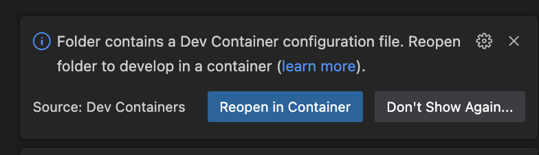

# 🐳 Using Dev Containers (Quick Start)

1. **Start Docker Desktop**
   Make sure Docker Desktop is installed and running before continuing.

2. **Install the VS Code Dev Containers extension**

   * In VS Code, click the **Extensions** icon on the left sidebar
   * Search for **“Dev Containers”** and install the extension (published by Microsoft).

3. **Open this project in VS Code**

   * From the top menu, select **File → Open Folder…**
   * Choose this repository’s root folder and click **Open**.

4. **Reopen the folder in a Dev Container**

   * When prompted, click **“Reopen in Container”** as shown below:
     
   * If no prompt appears, open the Command Palette (`Ctrl+Shift+P` / `Cmd+Shift+P`), type **“Dev Containers: Reopen in Container”**, and select it.

5. **Start working**
   Once the container build completes, your terminal will open inside the Dev Container.
   You can now run commands as usual, for example:

   ```bash
   python3 your_script.py
   ```

✅ **Tip:** Everything runs inside the container — no need to install Python or dependencies on your local machine.
